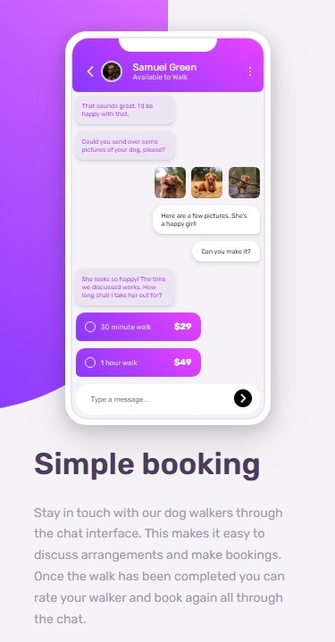

# Frontend Mentor - Chat app CSS illustration solution

This is a solution to the [Chat app CSS illustration challenge on Frontend Mentor](https://www.frontendmentor.io/challenges/chat-app-css-illustration-O5auMkFqY). Frontend Mentor challenges help you improve your coding skills by building realistic projects. 

## Table of contents

- [Overview](#overview)
  - [The challenge](#the-challenge)
  - [Screenshot](#screenshot)
  - [Links](#links)
- [My process](#my-process)
  - [Built with](#built-with)
  - [What I learned](#what-i-learned)
  - [Continued development](#continued-development)
  - [Useful resources](#useful-resources)
- [Author](#author)

## Overview

### The challenge

Users should be able to:

- View the optimal layout for the component depending on their device's screen size
- **Bonus**: See the chat interface animate on the initial load

### Screenshot

## Mobile

<div align="center">


</div>

## Desktop

<div align="center">


</div>

### Links

- Solution URL: [Add solution URL here](https://github.com/djenidisimple/chat-app-css-illustration)
- Live Site URL: [Add live site URL here](https://djenidisimple.github.io/chat-app-css-illustration/)

## My process

### Built with

- Flexbox
- CSS Grid
- Mobile-first workflow
- Position: fixed for purple and gray backgrounds
- Coolors.co tool for extracting colors from images

### What I learned

Through this project, I learned how to position elements in the background of my page. I also used various tools to complete this project, which helped me learn how to utilize different development tools.

Here's an example of the CSS code I used for the background:

```css
.background-one {
    position: fixed;
    top: -60px;
    left: -10%;
    width: 60%;
    height: 520px;
    z-index: 1;
    background: linear-gradient(45deg, var(--purple-500), var(--pink-400));
    border-bottom-right-radius: 350px;
}
```

### Continued development

I want to continue focusing on:
- Advanced CSS animations and transitions
- Responsive design techniques
- CSS architecture and organization
- Performance optimization

### Useful resources

- [Coolors.co](https://coolors.co/) - This tool helps extract color palettes from images and suggests complementary colors
- [Lucide Icons](https://lucide.dev/icons/) - This tool provides various icons for projects

## Author

- GitHub - [Djenidi](https://github.com/djenidisimple)
- Frontend Mentor - [@djenidisimple](https://www.frontendmentor.io/profile/djenidisimple)